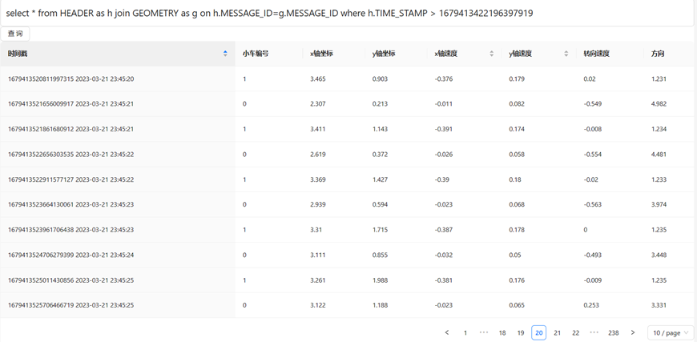
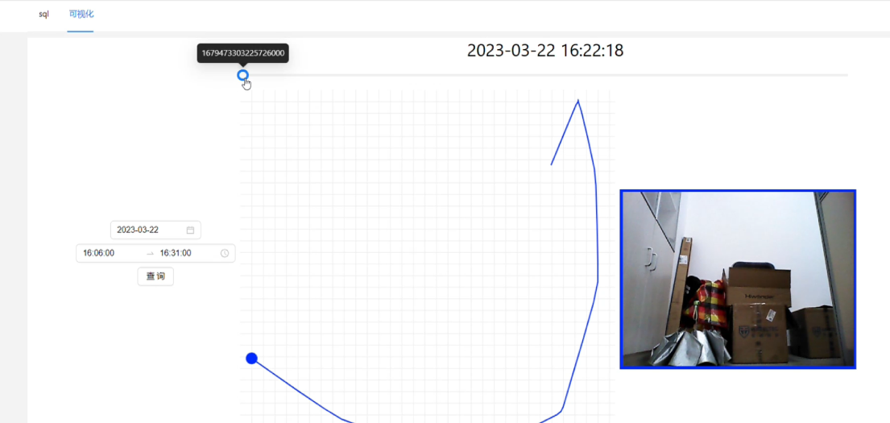
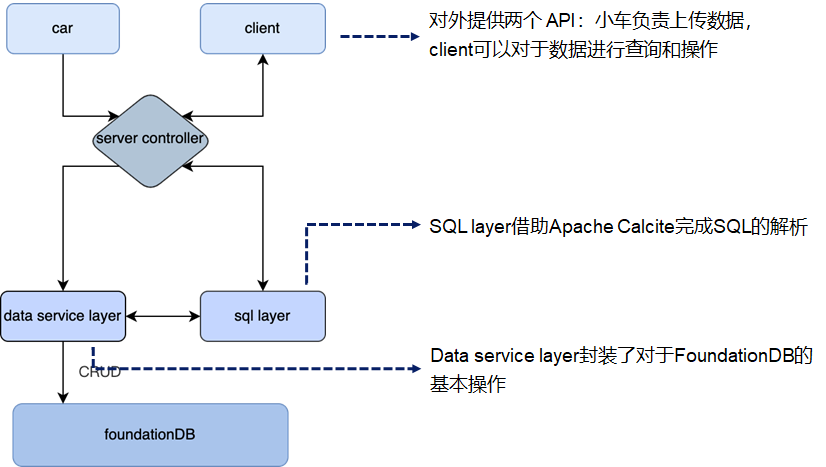
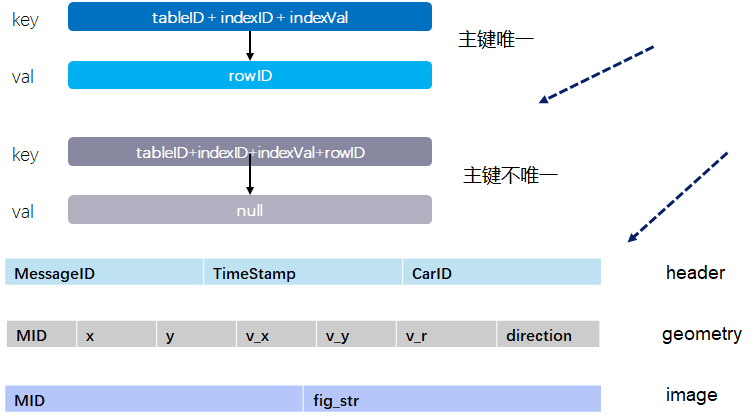
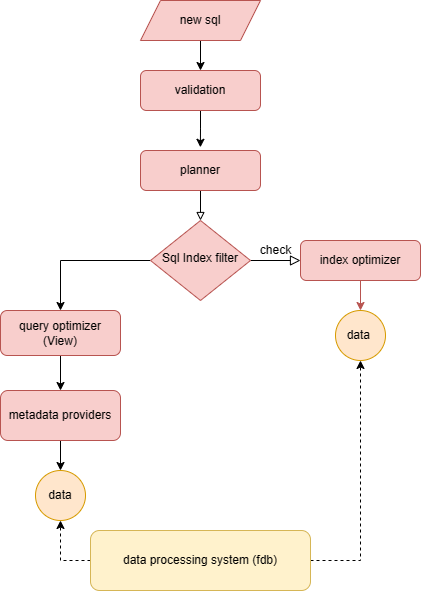

# README

## Overview

在这里我们实现了一个可以服务于小车行车数据记录的基于foundationDB的多模态云存储，我们在fdb上设计了关系式的存储模式、添加了索引支持并通过Calcite 完成了SQL的支持

项目的结构如下：

- deployment: 实现Dockerfile构建java项目，Docker-compose部署fdb集群与云存储
- frontend：使用react+antd，通过云存储模块提供的http接口展示sql查询的数据及小车位置的动态变化过程
- FdbServer：实现云存储的功能，提供SQL支持

## 项目总体效果

### SQL查询



### canvas路径绘制



## FDBServer实现细节

### FDBServer架构



### 项目文件结构

```txt
├─.idea                   
├─.mvn                    
│  └─wrapper              
└─src                     
    ├─fdbserver                
    │  ├─basicop   		// foundationDB CRUD操作的基本抽象
    │  ├─controller		// http操作的接口	
    │  ├─entity			// 数据库表抽象
    │  ├─service		
    │  ├─sqlparser
    │  │  ├─adapter		// calcite adaptor实现
    │  │  └─planner		// 对于索引加速查询的支持
    │  ├─test			// 一些单测，目前已经全部注释掉，可以帮助快速理解模块实现效果
    │  └─utils			// 元数据管理等
    │  	   ├─counter
    │  	   └─index
    │  └─resources
    │      └─protodata
    └─test
```

### 表设计



### SQL查询实现方案

